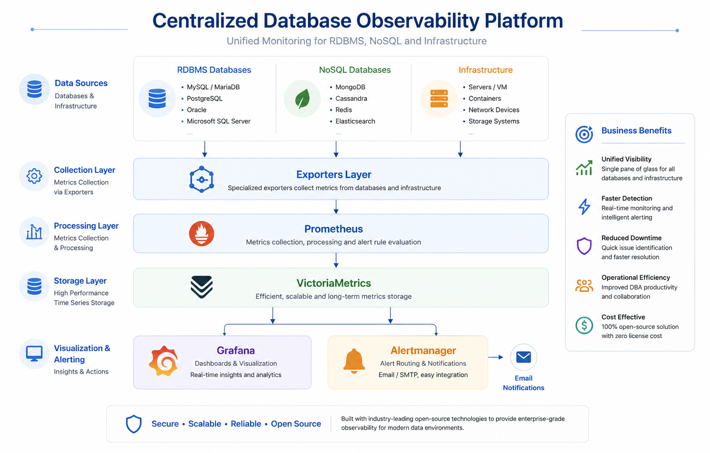

# Internal Database Observability Platform

Centralized monitoring platform for database and infrastructure metrics, built with:

- Exporters: collect metrics from DB and server hosts
- Prometheus: scrape exporters, service discovery, relabeling, alert rules
- VictoriaMetrics: long-retention metrics storage
- Grafana: dashboards and visualization
- Alertmanager: alert routing and notifications

## Architecture



Flow:

1. Node, Oracle, and MSSQL exporters expose metrics.
2. Prometheus scrapes exporter targets from generated `file_sd` YAML files.
3. Prometheus sends metrics to VictoriaMetrics using `remote_write`.
4. Grafana reads metrics from VictoriaMetrics.
5. Prometheus sends alerts to Alertmanager.

## Repository Layout

| Path | Purpose |
| --- | --- |
| `01_prepare_vm.sh` to `09_health_check.sh` | Step-by-step installer scripts |
| `deploy_all.sh` | Runs the full install flow |
| `inventory/targets.csv` | Source inventory for monitored hosts |
| `scripts/generate_targets.py` | Generates Prometheus target files |
| `config/prometheus.yml` | Prometheus scrape, alert, and remote write config |
| `config/targets/*.yml` | Generated Prometheus file service discovery targets |
| `config/alerts/*.yml` | Prometheus alert rules |
| `alertmanager/alertmanager.yml` | Alertmanager email routing template |
| `grafana/provisioning/` | Grafana datasource and dashboard provisioning |
| `systemd/*.service` | Systemd service files installed by the scripts |
| `docs/operator_handover.md` | DB grants, offline package manifest process, firewall, SELinux, validation |
| `docs/offline_package_manifest.example.csv` | Template for approved offline package versions and checksums |
| `docs/dpa_metric_catalog.md` | DPA-style metric coverage for node, Oracle, and MSSQL |
| `docs/alert_catalog.md` | Default alert thresholds and operational meaning |

## Deployment From Zero

Target OS used by the scripts: Oracle Linux 8 or another RHEL-compatible Linux with `dnf` or `yum`.

Run all commands from the repository root unless stated otherwise.

Before handover or production deployment, review the detailed operator guide:

```text
docs/operator_handover.md
docs/dpa_metric_catalog.md
docs/alert_catalog.md
```

### 1. Prepare Offline Packages

Put the installer files on the target VM before running `deploy_all.sh`.

Expected location:

```bash
/monitoring/sources/tar/
/monitoring/sources/rpm/
```

Expected file patterns:

```text
/monitoring/sources/tar/prometheus-*.linux-amd64.tar.gz
/monitoring/sources/tar/victoria-metrics-linux-amd64-*.tar.gz
/monitoring/sources/tar/alertmanager-*.linux-amd64.tar.gz
/monitoring/sources/tar/node_exporter*.tar.gz
/monitoring/sources/tar/oracledb_exporter*.tar.gz
/monitoring/sources/tar/mssql_exporter*.tar.gz
/monitoring/sources/rpm/grafana-*.rpm
```

If `/monitoring` does not exist yet, run only the preparation step first, then upload the packages:

```bash
sudo ./01_prepare_vm.sh
```

### 2. Edit Inventory

Edit:

```bash
inventory/targets.csv
```

Columns:

```text
host,ip,node,oracle,mssql,app,tier,owner
```

Use `yes` or `no` for `node`, `oracle`, and `mssql`.

### 3. Generate Prometheus Targets

Run:

```bash
python3 scripts/generate_targets.py
```

Generated files:

```text
config/targets/node_targets.yml
config/targets/oracle_targets.yml
config/targets/mssql_targets.yml
```

Review the generated ports:

| Service | Port |
| --- | --- |
| Node exporter | `9100` |
| Oracle exporter | `9161` |
| MSSQL exporter | `9182` |

### 4. Run Deployment

Run:

```bash
sudo ./deploy_all.sh
```

The script installs core services, copies configs and dashboards, enables systemd services, and runs `09_health_check.sh`.

### 5. Configure Database Exporter Credentials

The Oracle and MSSQL exporter installers create template credential files on the server. Edit them before starting the DB exporters:

```bash
sudo vi /monitoring/exporters/oracle/oracle_exporter.env
sudo vi /monitoring/exporters/mssql/mssql_exporter.env
```

Then start:

```bash
sudo systemctl restart oracle_exporter
sudo systemctl restart mssql_exporter
```

### 6. Configure Alert Email

Edit SMTP settings:

```bash
sudo vi /monitoring/alertmanager/conf/alertmanager.yml
sudo systemctl restart alertmanager
```

Replace the `CHANGE_ME` SMTP password and company placeholders before relying on email alerts.

### 7. Open Required Firewall Ports

Allow access from operators or from Prometheus to exporter nodes:

| Component | Port |
| --- | --- |
| Grafana | `3000` |
| Prometheus | `9090` |
| Alertmanager | `9093` |
| VictoriaMetrics | `8428` |
| Node exporter | `9100` |
| Oracle exporter | `9161` |
| MSSQL exporter | `9182` |

For Oracle Linux 8 `firewalld`, SELinux checks, and single VM vs 3 VM placement, see:

```text
docs/operator_handover.md
docs/deployment_plan_expand.md
```

### 8. Validate

Check services:

```bash
sudo ./09_health_check.sh
```

Open:

```text
http://VM_IP:9090/targets
http://VM_IP:9090/alerts
http://VM_IP:8428
http://VM_IP:3000
http://VM_IP:9093
```

Default Grafana login after RPM install is usually:

```text
admin / admin
```

Change the password on first login.

## Common Troubleshooting

Prometheus config:

```bash
sudo /monitoring/prometheus/bin/promtool check config /monitoring/prometheus/conf/prometheus.yml
```

Service logs:

```bash
sudo journalctl -u prometheus -f
sudo journalctl -u victoriametrics -f
sudo journalctl -u grafana-server -f
sudo journalctl -u alertmanager -f
sudo journalctl -u oracle_exporter -f
sudo journalctl -u mssql_exporter -f
```

Exporter endpoint checks:

```bash
curl http://localhost:9100/metrics
curl http://localhost:9161/metrics
curl http://localhost:9182/metrics
```

Detailed Prometheus and VictoriaMetrics validation queries are in:

```text
docs/operator_handover.md
```

## Notes For Operators

- Run the repository scripts from the repo root because they copy relative paths such as `./config`, `./grafana`, and `./systemd`.
- Prometheus keeps only short local retention (`1d`) and writes long-term data to VictoriaMetrics.
- Grafana datasource is provisioned to `http://localhost:8428`, so Prometheus `remote_write` must stay enabled.
- Database exporters are installed with template credentials. They should only be started after `DATA_SOURCE_NAME` is correct.
- DB user grants, offline checksum process, firewall commands, and metric validation are documented in `docs/operator_handover.md`.
