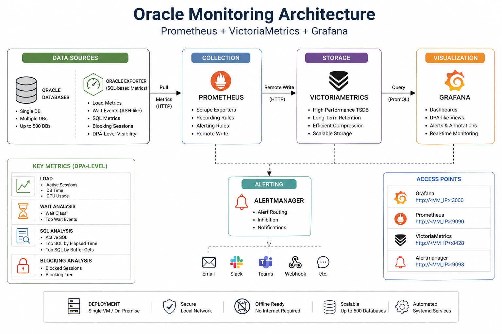

# Oracle Monitoring Design

## Overview

This document describes the design of Oracle database monitoring using Prometheus, VictoriaMetrics, and Grafana.

The goal is to provide **DPA-like visibility** using lightweight, query-based metrics.

---

## Monitoring Philosophy

We focus on:

1. **Load**
2. **Wait**
3. **SQL**
4. **Blocking**
5. **Baseline**
6. **Advisory**

These represent the core pillars of database performance analysis.

---

## Architecture

```text
Oracle DB
   ↓
Oracle Exporter (SQL-based metrics)
   ↓
Prometheus (scraper)
   ↓
VictoriaMetrics (storage)
   ↓
Grafana (visualization)
```

---

## Architecture Diagram

<p align="center">
  
</p>

---

## Core Metric Groups

### 1. Load Metrics

| Metric                   | Description       |
| ------------------------ | ----------------- |
| oracle_sessions_active   | Active sessions   |
| oracle_db_time_per_sec   | Database workload |
| oracle_cpu_usage_per_sec | CPU usage         |

Purpose:

- Measure real database load
- Detect spikes

---

### 2. Wait Analysis (ASH-like)

| Metric                     | Description             |
| -------------------------- | ----------------------- |
| oracle_ash_like_wait_class | Wait class distribution |
| oracle_ash_like_wait_event | Detailed wait events    |
| oracle_session_wait_sql    | Active waits by SQL, plan, module, action, service, user, machine |

Purpose:

- Identify bottlenecks
- Attribute active waits to SQL and application context
- Replace AWR/ASH basic insight

---

### 3. SQL Analysis

| Metric                     | Description        |
| -------------------------- | ------------------ |
| oracle_active_sql          | Active SQL         |
| oracle_top_sql_elapsed     | Heavy queries      |
| oracle_top_sql_buffer_gets | High logical reads |
| oracle_sql_workload_delta  | Recent SQL workload counters by SQL ID, plan, schema, module, action, service |
| oracle_sql_plan_count      | SQL IDs with multiple cached execution plans |

Purpose:

- Identify problematic queries
- Prefer recent rate and per-execution efficiency over cumulative cursor-cache totals
- Detect plan instability
- Support SQL tuning

---

### 4. Blocking Analysis

| Metric                  | Description                |
| ----------------------- | -------------------------- |
| oracle_sessions_blocked | Number of blocked sessions |
| oracle_blocking_tree    | Blocking relationships     |
| oracle_blocking_sql     | Blocking relationships by blocker and blocked SQL ID |

Purpose:

- Detect locking issues
- Identify root cause session
- Identify blocker SQL and victim SQL

---

### 5. Baseline and Anomaly Metrics

| Metric                                | Description             |
| ------------------------------------- | ----------------------- |
| oracle:db_time_per_sec:avg_7d         | 7-day DB time baseline  |
| oracle:wait_class_active_sessions:avg_7d | 7-day wait-class baseline |
| oracle:sql_elapsed_seconds_per_sec:avg_6h | 6-hour SQL elapsed baseline |

Purpose:

- Avoid one-size-fits-all thresholds
- Detect unusual workload for each database
- Highlight SQL regressions after plan changes

---

### 6. Advisory Rules

| Alert                         | Meaning                    |
| ----------------------------- | -------------------------- |
| OracleDBTimeAnomaly           | DB time is above baseline  |
| OracleWaitClassAnomaly        | A wait class is abnormal   |
| OraclePlanChangeRegression    | SQL has multiple plans and worse elapsed rate |
| OracleLogFileSyncPressure     | Commit latency pressure    |
| OracleSequentialReadPressure  | Single-block read pressure |
| OracleCursorContention        | Cursor/library cache contention |
| OracleParseStorm              | Excessive parsing          |
| OracleInefficientLogicalIO    | High buffer gets per execution |

Purpose:

- Turn raw metrics into diagnosis hints
- Route operators to the next useful dashboard panel
- Approximate DPA-style tuning advice without putting SQL text in Prometheus

---

## Data Flow

```text
Exporter → Prometheus → VictoriaMetrics → Grafana
```

---

## Grafana Dashboard Design

### Sections:

1. **Summary**
   - Active Sessions
   - DB Time
   - CPU
   - Blocking

2. **Wait Analysis**
   - Wait Class (Pie)
   - Top Wait Events

3. **SQL**
   - Active SQL
   - Top SQL by elapsed and CPU rate
   - Top SQL by buffer gets, disk reads, rows, and parse calls per execution
   - Plan change candidates

4. **Attribution**
   - Wait-to-SQL table
   - SQL load by module and service
   - Blocking by SQL

5. **Advisory**
   - Baseline ratio
   - DPA advisory and anomaly alerts

---

## Key Concepts

### DB Time

Represents total database workload.

- High DB time = system under load
- Compare with CPU to detect bottleneck

---

### Wait Events

Primary method to diagnose performance issues.

Examples:

| Event                       | Meaning        |
| --------------------------- | -------------- |
| db file sequential read     | IO bottleneck  |
| log file sync               | commit latency |
| latch: cache buffers chains | contention     |

---

### Active Sessions

Indicates concurrent workload.

High value = potential pressure.

---

### Blocking Sessions

Critical for production issues.

- Even 1 blocking session can cause outage

---

## Alert Strategy

Alerts should be based on:

- Active sessions threshold
- Blocking sessions > 0
- High DB time
- Exporter down

---

## Limitations

- Not full replacement for AWR/ASH
- Snapshot-based, not historical session trace
- SQL plan visibility is based on cached cursors unless optional snapshots are scheduled
- SQL text is intentionally kept out of Prometheus labels; use `config/oracle/oracle-sql-text-snapshot.sql` for drilldown storage

---

## Future Enhancements

- Scheduled SQL text and plan snapshot retention
- Grafana drilldown links from SQL ID to SQL text snapshot store
- Per-application adaptive baselines
- Automated runbook links in alert annotations
- Host-to-database topology mapping for stronger OS correlation

---

## Summary

This design provides:

- Lightweight monitoring
- Real-time insight
- DPA-like capability without licensing cost

---
